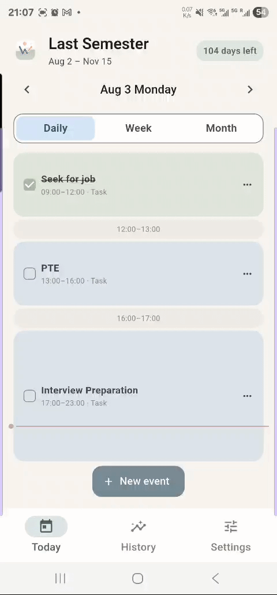
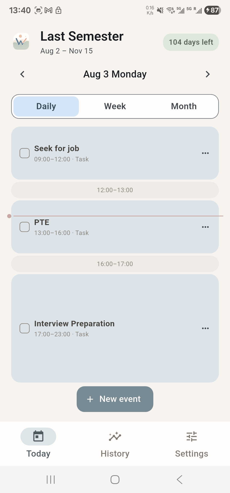
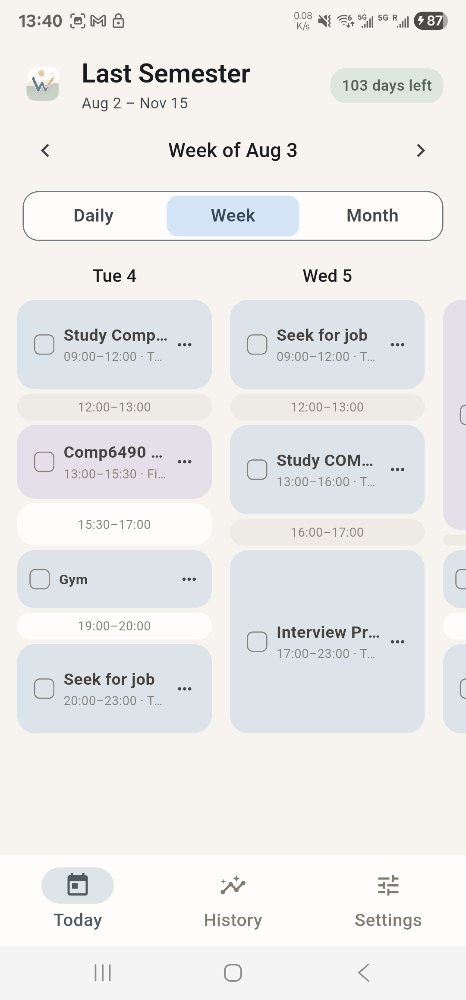
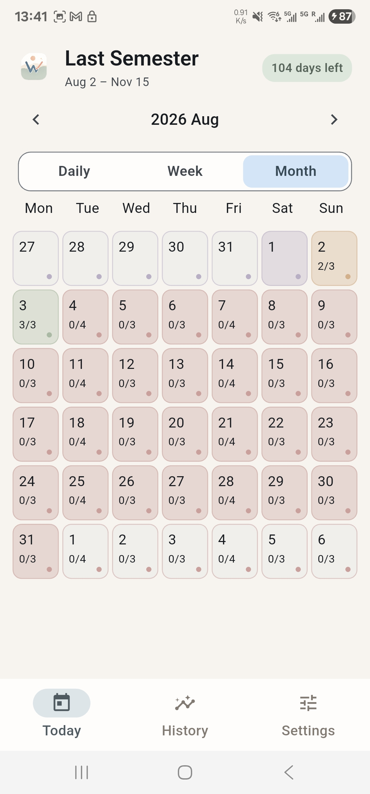
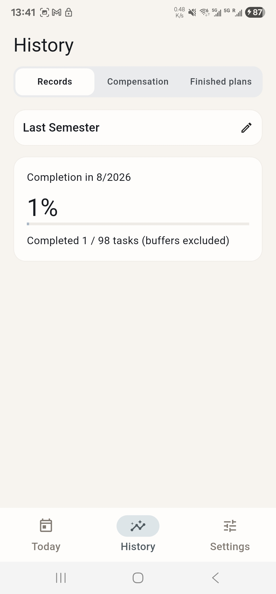
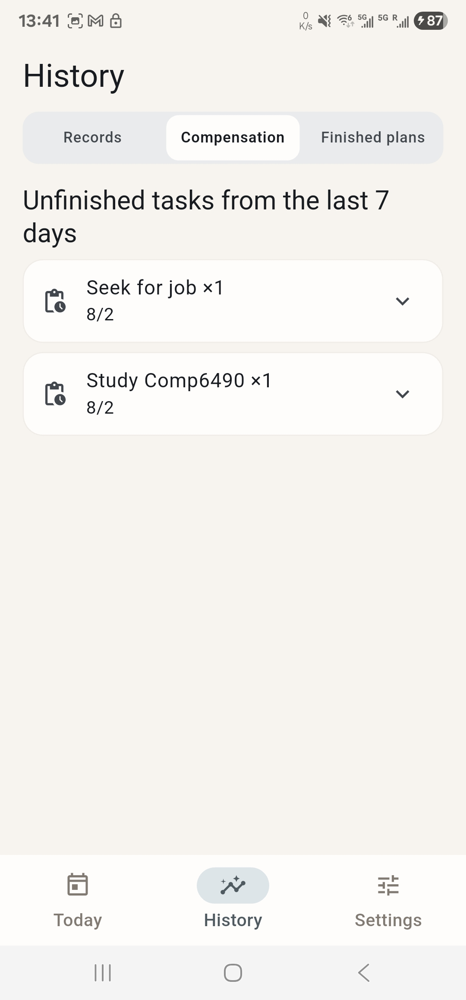
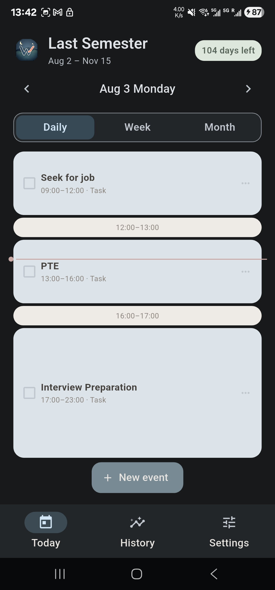

<div align="center">

# WeekPlanner

### Plan the week. Adapt each day. Make every effort count.

A local-first Flutter planner built around flexible weekly scheduling and a thoughtful 7-day compensation system.

[](https://flutter.dev/)
[](https://dart.dev/)
[](https://www.android.com/)
[](https://m3.material.io/)
[](LICENSE)

</div>

## Overview

**WeekPlanner** (app name: **Cadence**) is a personal planning and execution system that turns reusable weekly intentions into a practical daily schedule. Instead of treating every missed task as failure, it preserves context, supports recovery, and makes progress visible across daily, weekly, and monthly views.

The project demonstrates end-to-end Flutter development: domain modelling, local persistence, reactive state management, responsive calendar interfaces, Material 3 theming, and automated tests—all without requiring an account or cloud service.

## Design Philosophy

### Flexible weekly planning

Real weeks rarely unfold exactly as planned. WeekPlanner separates the **weekly template** from its generated **daily task instances**, allowing a plan to remain structured while its execution stays adaptable. Fixed commitments, focused tasks, and buffer periods share one continuous timeline rather than being forced into rigid time-of-day buckets.

### The 7-day compensation concept

An unfinished task is not immediately written off. For the following seven days, it appears in the compensation view, where completing a matching task can compensate for the oldest eligible missed occurrence. The original record remains traceable, and history distinguishes normal completions from compensated completions.

This creates a more humane feedback loop:

1. **Plan** a realistic weekly rhythm.
2. **Execute** tasks in day, week, or month context.
3. **Recover** unfinished work within a seven-day window.
4. **Reflect** using transparent completion history and trends.

## Features

- **Reusable weekly plans** — Create date-bounded plans with optional weekly recurrence.
- **Day, week, and month views** — Move between immediate focus and broader schedule context.
- **Continuous visual timeline** — Display tasks across configurable blocks and the gaps between them.
- **Flexible event editing** — Create, move, complete, and undo tasks while preserving history.
- **7-day compensation workflow** — Recover eligible unfinished tasks without hiding the original outcome.
- **Execution history** — Review completion totals, grouped unfinished tasks, and weekly trends.
- **Plan lifecycle management** — Retain completed instances while regenerating pending work after template changes.
- **Automatic light and dark themes** — Follow the device theme with a polished Material 3 interface.
- **Private, local-first storage** — Keep application data on-device in SQLite.
- **Tested domain logic** — Cover timeline rendering, conflict rules, lifecycle states, history metrics, and preferences.

## Screenshots

<div align="center">

### Product Demo



</div>

<br>

<table width="100%">
  <tr>
    <td width="33.33%" align="center"><strong>Daily planning</strong></td>
    <td width="33.33%" align="center"><strong>Weekly overview</strong></td>
    <td width="33.33%" align="center"><strong>Monthly context</strong></td>
  </tr>
  <tr>
    <td width="33.33%" align="center" valign="top"></td>
    <td width="33.33%" align="center" valign="top"></td>
    <td width="33.33%" align="center" valign="top"></td>
  </tr>
  <tr>
    <td width="33.33%" align="center"><strong>Execution records</strong></td>
    <td width="33.33%" align="center"><strong>Compensation history</strong></td>
    <td width="33.33%" align="center"><strong>Dark mode</strong></td>
  </tr>
  <tr>
    <td width="33.33%" align="center" valign="top"></td>
    <td width="33.33%" align="center" valign="top"></td>
    <td width="33.33%" align="center" valign="top"></td>
  </tr>
</table>

## Technology Stack

| Area | Technology |
| --- | --- |
| Application | Flutter, Dart |
| Interface | Material 3 |
| State management | Provider |
| Local persistence | SQLite via `sqflite` |
| Date and time | `intl` |
| Identifiers | `uuid` |
| Quality | `flutter_test`, `flutter_lints` |
| Target | Android |

## Architecture

WeekPlanner keeps planning intent separate from calendar execution:

```text
Plan -> WeekTemplate -> TaskInstance
```

- A `Plan` defines its name, active date range, recurrence, and lifecycle state.
- A `WeekTemplate` describes reusable weekday events.
- A `TaskInstance` is a persisted occurrence that can be completed, moved, or compensated.

The codebase follows a clear layered structure: domain rules remain independent of presentation, repositories own SQLite persistence and instance generation, controllers coordinate application state, and UI components render the Material 3 experience.

## Installation

### Prerequisites

- Flutter SDK with Dart `>=3.3.0 <4.0.0`
- Android SDK and platform tools
- JDK 17
- An Android emulator or physical Android device

Confirm that the toolchain is ready:

```bash
flutter doctor
```

### Run locally

```bash
git clone <your-repository-url>
cd WeekPlanner
flutter pub get
flutter run
```

### Run tests

```bash
dart format --output=none --set-exit-if-changed lib test tool
flutter test
```

### Build a release APK

```bash
flutter build apk --release
```

The APK will be available at `build/app/outputs/flutter-apk/app-release.apk`.

## Project Structure

```text
WeekPlanner/
├── android/                 # Android host project and Gradle configuration
├── assets/
│   ├── branding/            # App icons, logos, and visual identity
│   └── screenshots/         # README product screenshots
├── docs/                    # Project documentation
├── lib/
│   ├── data/                # SQLite repository and instance generation
│   ├── domain/              # Plans, history, timelines, and business rules
│   ├── state/               # Controllers and application preferences
│   ├── ui/                  # Screens, editors, dialogs, and widgets
│   └── main.dart            # Application entry point and themes
├── test/                    # Unit and Flutter tests
├── tool/                    # Standalone development checks
├── analysis_options.yaml    # Static-analysis configuration
└── pubspec.yaml             # Package metadata and dependencies
```

## Roadmap

- [x] Recurring weekly plans and generated daily instances
- [x] Daily, weekly, and monthly schedule views
- [x] Configurable continuous timelines
- [x] Completion tracking and 7-day compensation
- [x] Historical summaries and weekly trends
- [x] Local SQLite persistence
- [x] Light and dark Material 3 themes
- [ ] Accessibility and usability refinement
- [ ] Data export, import, and backup
- [ ] Notification and reminder support
- [ ] Expanded integration and widget testing
- [ ] Production release metadata and store distribution

## Documentation

For the product rationale, feature walkthrough, and design details, read the [WeekPlanner Introduction](docs/WeekPlanner-Introduction.pdf).

## License

This project is available under the [MIT License](LICENSE).

---

<div align="center">
  Built with Flutter for people who want structure without rigidity.
</div>
